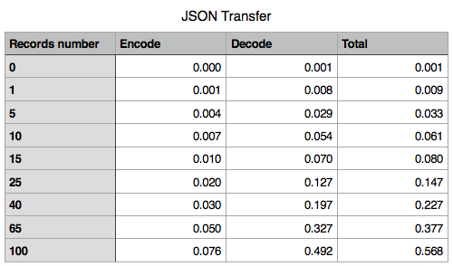

# Benchmarks for Protocol Buffers and JSON while using Swift for both client and server

### Goal
The plan is to measure some resource loading (serializing + transfer + parsing) times and see if there is a real world difference between JSON and Proto.


### My Test Bench Setup
* Mac Mini (Mid 2011)
  * 2.5 GHz Intel Core i5
  * 8 GB 1333 MHz DDR3
  * 250 GB Samsung 850 SSD
  * OS X El Capitan 10.11.6 (15G1217)
* iPhone 5 running iOS 9.3.5
* Xcode 8.2.1 (8C1002)
* [Vapor (Web Framework for Swift)](https://vapor.codes)  1.4
* [Release 0.9.26 · apple/swift-protobuf · GitHub](https://github.com/apple/swift-protobuf/releases/tag/0.9.26)


### Setting up the web app

Since I’ve wanted an apples to apples comparison, I’ve decided that the best way to drive this benchmark is by implementing a Swift web app, to do the lifting, serialize the data and fire it back down the wire.

Hence, I’ve  chosen [Vapor](https://vapor.codes) to be my web framework of choice for this experiment. Setting up a quick hello world demo requires just the following lines of `bash commands` and a short code snipped to be pasted in the `main.swift` file.

> $ vapor new hello_world --template=light  
> $ cd hello_world/  
> $ vapor xcode -y  

main.swift:
```swift
import Vapor

let drop = Droplet()

drop.get { request in
    return "Hello World"
}

drop.run()
```

Once you’ve filled in everything, you can just hit run on Xcode, or type `$ vapor run` in your terminal window and the server will automatically run by default at `0.0.0.0:8080` . Go ahead and open your favorite browser and access  `http://0.0.0.0:8080` . It works 🎉!

In order to continue, make sure that you use the latest Vapor version.  Vapor is imported using the Swift Package Manager so in order to update it, check the `Package.swift` file present at the root of your project. If needed, update its content to match the version you desire.

Vapor 1.4
```swift
import PackageDescription

let package = Package(
    name: "hello_world",
    dependencies: [
        .Package(url: "https://github.com/vapor/vapor.git", majorVersion: 1, minor: 4)
    ]
)
```

Once you’ve updated `Package.swift` return to the console and run `$ swift package update` from the root of your project. This may take a while. 😴

Once finished, re-run `$ vapor xcode -y` to update project dependencies.

Now that we have our vapor setup ready lets focus on the data serializer of choice [Protocol Buffers v3](https://developers.google.com/protocol-buffers/docs/proto3)


### Setting up Protocol Buffers

By simply checking the [documentation](https://developers.google.com/protocol-buffers/docs/proto3), we can see that Protocol Buffers allow JSON mapping also, this being another selling point for this benchmark, given the limited number of dependencies that have to be used in order to build the solution.

Not that far ago Chris Lattner announced the official Swift support for protobufs on Twitter, this making [GitHub - apple/swift-protobuf: Plugin and runtime library for using protobuf with Swift](https://github.com/apple/swift-protobuf) the right candidate for our task.


The plugin integrates seamlessly with the Swift Package Manager, the only thing for us to do is to add the next line in the `Package.swift` file.
> .Package(url: "https://github.com/apple/swift-protobuf.git", Version(0,9,26))  

Next, run `$ swift package update` to update dependencies, and  `$ swift package generate-xcodeproj` to update the project.

In order to define the actual model that will be passed down the wire and consumed by our clients we have to use the proto syntax to define a .proto file.
```proto
syntax = "proto3"

message Beer {
    double alcohol = 1;
    string name = 2;
    string brewedBy = 3;
    string style = 4;
    string availability = 5;
    string serving = 6;
    string details = 7;
}

message BeerList {
    repeated Beer beers = 1;
}
```

This will act as communication protocol, and model since it can be compiled for a large number of programing languages.
In order to generate Swift code out of the proto model two prerequisites are needed:

* protoc (proto compiler) ( [Google’s protobuf compiler - Installation guide](https://github.com/google/protobuf/blob/master/src/README.md) )
* protoc swift plugin [Apple protobuf plugin - Installation Guide](https://github.com/apple/swift-protobuf/blob/master/Documentation/PLUGIN.md)

Once these steps are concluded, you are left to run the following bash line in order to have the `DataModel.pb.swift` file created for you.
> protoc --swift_out=. DataModel.proto   


### Extending the DataModel

The generated file is a standalone swift file, that shouldn’t be edited. For any  additions you can easily create a separate extension to accommodate your needs.

In my case, I would like to add the possibility to make the model `NodeRepresentable` or `ResponseRepresentable`  in Vapor’s context.

```swift
import Foundation
import Vapor
import HTTP

extension Beer: NodeRepresentable {
    func makeNode(context: Context) throws -> Node {
        return try Node(node: [
            "name": name,
            "brewedBy": brewedBy,
            "style": style,
            "availability": availability,
            "serving": serving,
            "alcohol": alcohol,
            "details": details
            ])
    }
}

extension BeerList {
    func toJSON() throws -> ResponseRepresentable {
        guard let data = try? self.serializeJSON() else {
            return Response(status: .internalServerError)
        }
        return Response(status: .ok, headers: ["Content-Type": "application/json"], body: data)
    }

    func toProto() throws -> ResponseRepresentable {
        guard let data = try? self.serializeProtobuf() else {
            return Response(status: .internalServerError)
        }
        return Response(status: .ok, headers: ["Content-Type": "application/octet-stream"], body: data)
    }
}
```

To build my datasource, I’ve used the informations provided by [BreweryDB.com](http://www.brewerydb.com), and I’ve created a JSON file that will be loaded during server’s start routine, and its data will be served from memory.

Hence I’ve built a new extension file to deal with the initialization from a Dictionary object.


### Routing client requests on the server

In order to serve beers to our clients, I’ve ended up building a REST API, that will rely on the following route `/beers?start=0&limit=10` , while having the options to control the number of items returned. The Parameters can be both passed as URL query params or in body params, since Vapor will handle this behind the scenes.

To decide on the serialization option to be delivered for there requests , I’ve used the `Accept` header value to pick between `application/json` or `application/octet-stream`. Hence, I’ve restricted resource access only to those clients that conform to this request. Testing this from  the browser will end up with en error since  `*/*`  value is not handled.

```swift
// /beers?start=0&limit=10
drop.get("beers") { request in

    guard let allBeers = allBeers else {
        return Response(status: .internalServerError)
    }

    let suportedTypes: [ResponseType] = [.json, .octetStream]

    guard let mediaType = request.accept.first?.mediaType,
        let requestedType = ResponseType(rawValue: mediaType) else {
            throw Abort.custom(status: .badRequest, message: "Unsuported accept type: \(request.accept.first?.mediaType).")
    }

    var start: Int = request.data["start"]?.int ?? 0
    var limit: Int = request.data["limit"]?.int ?? 10

    start = start < allBeers.count ? start : -1
    limit = (start + limit) < allBeers.count ? limit : allBeers.count - 1 - start

    guard start != -1, limit != -1 else {
        throw Abort.custom(status: .badRequest, message: "Invalid start or/and limit parameters.")
    }

    let slice: ArraySlice<Beer> = allBeers[start..<(start + limit)]
    var beerList = BeerList()
    beerList.beers = Array(slice)

    do {
        switch requestedType {
        case .json:
            return try beerList.toJSON()
        case .octetStream:
            return try beerList.toProto()
        }
    } catch {
        return Response(status: .internalServerError)
    }
}
```

Once the input params are processed and the right slice has been created, we use the extension methods to serialize and return the expected data to the client requesting it.


### Client

Since we are relying on Protocol Buffer’s capabilities to serialize/deserialize JSON and Proto content, we will be able to reuse the same code on the client side. That is one of the best things you can achieve since you will be able to extract lots of models and helpers into a dedicated framework that can be heavily unit tested and then shared between your client and server side app at zero costs. For now, just to keep things simple, we will reference the files previously developed on server and include them in out client project.

For the sake of comparison here are the files that are included on the server project, and the underlined ones are also referenced in the client solution:
* ~DataModel.pb.swift~
* ~DataModel+DictionaryInitializable.swift~
* ~ResponseType.swift~
* ~String+Error.swift~
* DataModel+ResponseRepresentable.swift
* Utils.swift
* main.swift

Pretty nice huh 😅?!

The client side is a dummy Single Page iOS app, with the single purpose of running some unit tests.
Like I did on the server project, I have to link the client against the SwiftProtobuf framework, and since the Swift Package Manager in not yet supported on the iOS projects, I’ll default to [CocoaPods.org](https://cocoapods.org) for this.

In order to setup the stage of the unit tests, I had to come up with a subclass of `Operation` (former NSOperation) to handle the network call.

```swift
import Foundation

final class NetworkOperation: Operation {
    var session: URLSession {
        return URLSession(configuration: config, delegate: self, delegateQueue: nil)
    }
    var config: URLSessionConfiguration {
        return URLSessionConfiguration.default
    }
    var request: URLRequest?
    var responseHandler: ((_ data: Data) -> ())?

    fileprivate(set) var sessionTask: URLSessionTask?
    fileprivate var incomingData = Data()

    private var _isFinished: Bool = true
    override var isFinished: Bool {
        get {
            return _isFinished
        }
        set (newAnswer) {
            willChangeValue(forKey: "isFinished")
            _isFinished = newAnswer
            didChangeValue(forKey: "isFinished")
        }
    }

    override func start() {
        if isCancelled {
            isFinished = true
            return
        }
        guard let request = request else { fatalError("Failed to start without URL request") }

        // cancel ongoing task
        sessionTask?.cancel()

        // launch new task
        sessionTask = session.dataTask(with: request)
        sessionTask!.resume()
    }

    override func cancel() {
        sessionTask?.cancel()
    }
}

extension NetworkOperation: URLSessionDataDelegate {
    func urlSession(_ session: URLSession,
                    dataTask: URLSessionDataTask,
                    didReceive response: URLResponse,
                    completionHandler: @escaping (URLSession.ResponseDisposition) -> Void) {
        if isCancelled {
            isFinished = true
            sessionTask?.cancel()
            return
        }

        completionHandler(.allow)
    }

    func urlSession(_ session: URLSession, dataTask: URLSessionDataTask, didReceive data: Data) {
        if isCancelled {
            isFinished = true
            sessionTask?.cancel()
            return
        }
        incomingData.append(data)
    }


    func urlSession(_ session: URLSession, task: URLSessionTask, didCompleteWithError error: Error?) {
        if isCancelled {
            isFinished = true
            sessionTask?.cancel()
            return
        }

        if error != nil {
            print("Network operation failed: \(error)")
            isFinished = true
            return
        }
        responseHandler?(incomingData)
        isFinished = true
    }
}
```

Having this settled, the next step was to define an utility function to be used inside the tests.

```swift
    func requestBeers(_ host: Host, start: UInt, limit: UInt , responseType: ResponseType, completion: @escaping (_ payloadSize: Int) -> ())  {
        let url = URL(string: "\(host.rawValue)/beers?start=\(start)&limit=\(limit)")
        var request = URLRequest(url: url!)
        request.setValue(responseType.rawValue, forHTTPHeaderField: "Accept")

        let operation = NetworkOperation()
        operation.request = request
        operation.responseHandler = { data in
            do {
                switch responseType {
                case .json:
                    let jsonString = String.init(data: data, encoding: .utf8)!
                    _ = try BeerList(json: jsonString)
                default:
                    _ = try BeerList(protobuf: data)
                }

                completion(data.count)
            } catch let error {
                print("You can huff and puff, but it failed like this: \(error)")
            }
        }

        operation.start()
    }
```


### Benchmarks

The following tests have been performed on the same data collection,  varying the number of records fetched based on the following scale: 0, 1, 5, 10, 15, 25, 40, 65, 100.

The tests where performed on both the simulator and a physical device, using Xcode’s  performance tests capabilities (each test is being ran for 10 times).


#### Size Comparison

The first round consists in comparing the actual bandwidth consumed by these records while flushed down the wire.


It is really interesting to see how the Proto serialization is about 16% less then the equivalent JSON sibling. That’s a nice thing to keep in mind for those occasionally large payloads. But does it improve the overall user experience? Let’s check the end to end measurements.

#### End to end data loading
This metric will cover the entire loading time the user has to wait from the moment he launched the network operation to the moment the received data is parsed and ready to be displayed. Hence, it covers the server side serialization time, the network transfer time, and the client parsing time.

Here, the tests have been performed on the local Wi-Fi network since I haven’t deployed the server on AWS or Heroku.


##### Wi-Fi Only


Over Wi-Fi, Proto loading times where up to 4 times faster than the equivalent JSON sibling. “What a great start” I was thinking 😅. But moving over simulated 3G showed me that measuring network latency should not be my goal for this experiment.

##### Simulated 3G over wifi using Network link conditioner


On 3G, the race was head to head, and the overall performance improvements where around 15%, but this kind of measurements are not so reliable. So, in order to see if Proto can be a real winner I’ve planned to remove the network latency from the equation and measure something that can return a set of reliable results, no matter how many times I’m running the tests.

#### Encoding + Decoding times
The previous test was basically measuring the end to end experience, adding the times required for the model to be serialized, flushed down the wire, and decoded on the mobile client. Since the network aspect was problematic during the last test, I’ve moved forward and measured the time required by the Mac Mini to serialize the payload, and the times required by the iPhone 5 to deserialize it. This way we can easily comprehend how fast the Proto experience is, while treating the network part as a black box.


Like you can see above, the overall Proto performance on encoding is averaging over 450%, and slightly over 230% while decoding.

Merging these two tables together, will return the overall time a user will ideally wait to have his data marshaled and un-marshaled in order for him to use it.




On the Proto side, the things look fast, while the JSON sibling looks a little bit rusty. How rusty?


About 250% difference which translates in 3.5 times faster. That’s rusty 👻!


### Conclusions

While the initial goal was to see how fast Proto can really get, the overall output will be tailored more as a list of reasons why you should pick Protocol Buffers as the main serialization protocol on your next project.

* having a 250% advantage over the JSON sibling seems pretty good start
* being able to reuse a lot of code between your client and server app can be a plus (if you are using a Swift server)
* forgetting about XML parsing or JSON mapping can make another good reason too
* you’ll be acting like a cool kid and you probably should, because you are expanding your horizon


***

#### References

* [Benchmarks for the Top Server-Side Swift Frameworks vs. Node.js](https://medium.com/@rymcol/benchmarks-for-the-top-server-side-swift-frameworks-vs-node-js-24460cfe0beb#.uzt8s5aae)
* [Deployment of a Swift Vapor App to the AWS EC2 Cloud](https://medium.com/swiftybeaver-blog/deployment-of-a-vapor-app-to-aws-ec2-f577eaa6c38c#.jben23hhv)
* [Full-stack Swift - Part 1 - code centric AG Blog : code centric AG Blog](https://blog.codecentric.de/en/2016/10/full-stack-swift-part-1/)
* [GitHub - apple/swift-protobuf: Plugin and runtime library for using protobuf with Swift](https://github.com/apple/swift-protobuf)
* https://developer.ibm.com/swift/2016/09/30/protocol-buffers-with-kitura/
* https://medium.com/@azamsharp/look-maa-server-side-swift-using-vapor-638cc3f5a5a8#.jqha48w0n
* [Protocol Buffer Basics](https://developers.google.com/protocol-buffers/docs/javatutorial#defining-your-protocol-format)
